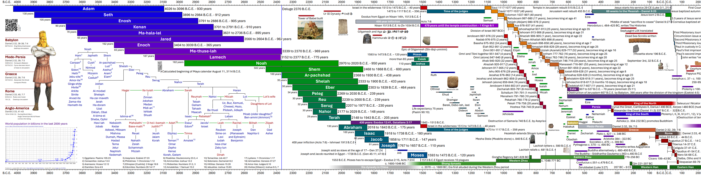

# A Timeline of human history

This [project](https://github.com/kreier/timeline) creates a graph of Human history with python and ~~reportlab~~ fpdf2. Version v3.5 replicates and expands the information of v1.1 from 2009 on one single page. After 15 years of slow development some images make it into the timeline in early 2024 with v4.2.

Compare this 4000 year timespan of **v5.10 from 2025** with the same time period in **v1.1 from 2009** (below):

You see that **many more details** were added. And something is off with the scale - explained later - since the **scale** (millimeter/year) in 2009 was not constant.

### Translations

The language specific files have been separated from the program code (together with other information, data and list of colors) since version 3.4. While I put the translated string into an utf-8 encoded `.csv` file, the very process is not that straightforward. It starts with a proper translation (cloud APIs for Azure cloud and Googletranslate are only a start), continues with fontfiles that support this language and glyphs (January 2024 with CJK) and continues with font shaping engines like harfbuzz (May 2024) for complexer writing systems like Persian, Devanagari for Hindi, Khmer and Sinhala, among a few. Currently there are 475 text fields in total in a few languages. The print edition has 5cm extra left and right for the rollers at the end of the scroll. The reference size is 1308x210 mm but it can be scaled to any size at the print shop:

| Language                                                                |                    print                                    | names | reviewed | complete |   latest   |
|-------------------------------------------------------------------------|:-----------------------------------------------------------:|:-----:|:--------:|:--------:|:----------:|
| [English](https://timeline24.github.io/timeline_en.pdf)                 | [link](https://timeline24.github.io/timeline_en_print.pdf)  |   x   |     x    |     x    | 2025-09-24 |
| [Arabic (العربية)](https://timeline24.github.io/timeline_ar.pdf)       | [link](https://timeline24.github.io/timeline_ar_print.pdf)  |   x   |          |          | 2024-07-25 |
| [Armenian (Հայերեն)](https://timeline24.github.io/timeline_hy.pdf)      | [link](https://timeline24.github.io/timeline_hy_print.pdf)  |   x   |          |          | 2025-09-17 |
| [Cebuano (Bisayâ)](https://timeline24.github.io/timeline_ceb.pdf)       | [link](https://timeline24.github.io/timeline_ceb_print.pdf) |       |          |          | 2025-09-17 |
| [Chinese Cantonese (Simplified) (普通话)](https://timeline24.github.io/timeline_yue.pdf) | [link](https://timeline24.github.io/timeline_yue_print.pdf) | x |  |      | 2024-06-16 |
| [Chinese Mandarin (Simplified) (普通话)](https://timeline24.github.io/timeline_zh.pdf)   | [link](https://timeline24.github.io/timeline_zh_print.pdf)  | x |  |      | 2024-06-14 |
| [Estonian (eesti keel)](https://timeline24.github.io/timeline_et.pdf)   | [link](https://timeline24.github.io/timeline_et_print.pdf)  |   x   |          |          | 2025-05-03 |
| [Finnish (Suomi)](https://timeline24.github.io/timeline_fi.pdf)         | [link](https://timeline24.github.io/timeline_fi_print.pdf)  |       |          |          | 2024-06-14 |
| [French (Français)](https://timeline24.github.io/timeline_fr.pdf)       | [link](https://timeline24.github.io/timeline_fr_print.pdf)  |   x   |     x    |          | 2025-09-24 |
| [German (Deutsch)](https://timeline24.github.io/timeline_de.pdf)        | [link](https://timeline24.github.io/timeline_de_print.pdf)  |   x   |     x    |     x    | 2025-09-24 |
| [Greek (Ελληνικά)](https://timeline24.github.io/timeline_el.pdf)        | [link](https://timeline24.github.io/timeline_el_print.pdf)  |   x   |          |          | 2025-09-17 |
| [Hebrew (עִבְרִית)](https://timeline24.github.io/timeline_he.pdf)         | [link](https://timeline24.github.io/timeline_he_print.pdf)  |       |          |          | 2025-09-17 |
| [Hindi (हिन्दी)](https://timeline24.github.io/timeline_hi.pdf)            | [link](https://timeline24.github.io/timeline_hi_print.pdf)  |       |          |          | 2025-09-17 |
| [Igbo (Ásụ̀sụ́ Ìgbò)](https://timeline24.github.io/timeline_ig.pdf)       | [link](https://timeline24.github.io/timeline_ig_print.pdf)  |       |          |          | 2025-02-18 |
| [Iloko (Ilocano)](https://timeline24.github.io/timeline_ilo.pdf)        | [link](https://timeline24.github.io/timeline_ilo_print.pdf) |   x   |     x    |     x    | 2024-06-07 |
| [Italian (Italiano)](https://timeline24.github.io/timeline_it.pdf)      | [link](https://timeline24.github.io/timeline_it_print.pdf)  |   x   |     x    |     x    | 2024-06-07 |
| [Japanese (日本語)](https://timeline24.github.io/timeline_ja.pdf)        | [link](https://timeline24.github.io/timeline_ja_print.pdf)  |   x   |    x     |          | 2024-06-11 |
| [Kankana-ey](https://timeline24.github.io/timeline_kne.pdf)             | [link](https://timeline24.github.io/timeline_kne_print.pdf) |   x   |     x    |     x    | 2024-06-07 |
| [Khmer (ខ្មែរ)](https://timeline24.github.io/timeline_km.pdf)             | [link](https://timeline24.github.io/timeline_km_print.pdf)  |   x   |          |          | 2024-06-19 |
| [Khmer (ខ្មែរ) with Arabic numerals](https://timeline24.github.io/timeline_kman.pdf)  | [link](https://timeline24.github.io/timeline_kman_print.pdf) | x | |          | 2024-06-24 |
| [Kikongo](https://timeline24.github.io/timeline_kg.pdf)                 | [link](https://timeline24.github.io/timeline_kg_print.pdf)  |   x   |          |          | 2025-09-17 |
| [Korean (한국인)](https://timeline24.github.io/timeline_ko.pdf)          | [link](https://timeline24.github.io/timeline_ko_print.pdf)  |       |          |          | 2024-06-16 |
| [Malay (Bahasa Melayu)](https://timeline24.github.io/timeline_ms.pdf)   | [link](https://timeline24.github.io/timeline_ms_print.pdf)  |   x   |          |          | 2025-09-17 |
| [Norwegian (Norsk)](https://timeline24.github.io/timeline_no.pdf)       | [link](https://timeline24.github.io/timeline_no_print.pdf)  |   x   |          |          | 2024-06-16 |
| [Persian (فارسی)](https://timeline24.github.io/timeline_fa.pdf)         | [link](https://timeline24.github.io/timeline_fa_print.pdf)  |   x   |          |          | 2025-09-17 |
| [Portugese (Português)](https://timeline24.github.io/timeline_pt.pdf)   | [link](https://timeline24.github.io/timeline_pt_print.pdf)  |   x   |          |          | 2025-09-17 |
| [Punjabi (ਪੰਜਾਬੀ)](https://timeline24.github.io/timeline_pa.pdf)          | [link](https://timeline24.github.io/timeline_pa_print.pdf)  |       |          |          | 2025-09-17 |
| [Russian (Русский)](https://timeline24.github.io/timeline_ru.pdf)       | [link](https://timeline24.github.io/timeline_ru_print.pdf)  |   x   |          |          | 2024-06-17 |
| [Sinhala (සිංහල)](https://timeline24.github.io/timeline_si.pdf)         |  [link](https://timeline24.github.io/timeline_si_print.pdf) |       |          |          | 2024-06-11 |
| [Spanish (Español)](https://timeline24.github.io/timeline_es.pdf)       | [link](https://timeline24.github.io/timeline_es_print.pdf)  |   x   |          |          | 2025-02-27 |
| [Swahili (Kiswahili)](https://timeline24.github.io/timeline_sw.pdf)     | [link](https://timeline24.github.io/timeline_sw_print.pdf)  |       |          |          | 2025-09-17 |
| [Filipino (Tagalog)](https://timeline24.github.io/timeline_tl.pdf)      | [link](https://timeline24.github.io/timeline_tl_print.pdf)  |   x   |     x    |     x    | 2024-06-07 |
| [Thai (ภาษาไทย)](https://timeline24.github.io/timeline_th.pdf)          | [link](https://timeline24.github.io/timeline_th_print.pdf)  |       |          |          | 2024-06-14 |
| [Ukrainian (українська)](https://timeline24.github.io/timeline_uk.pdf)   | [link](https://timeline24.github.io/timeline_uk_print.pdf) |   x   |          |          | 2025-09-17 |
| [Urdu (اُردُو)](https://timeline24.github.io/timeline_ur.pdf)             | [link](https://timeline24.github.io/timeline_ur_print.pdf)  |       |          |          | 2025-09-17 |
| [Vietnamese (Tiếng Việt)](https://timeline24.github.io/timeline_vi.pdf) | [link](https://timeline24.github.io/timeline_vi_print.pdf)  |   x   |          |     x    | 2025-02-20 |

Support for languages using the CJK glyphs took some extra work, and I learned a lot about tofu and NO TOfu (noto) and related projects in January 2024. For Khmer, Sinhala and Arabic I finally needed a shape engine like [harfbuzz](https://github.com/harfbuzz/harfbuzz). Since it is not supported in reportlab, I switched to [fpdf2](https://py-pdf.github.io/fpdf2/index.html) with version 4.7 in July 2024. 

## Reactivation 2023

After 14 years it was finally time to translate the project to English and share with my friends. In the years since 2009 I learned a lot about programming languages, vector graphics and possible solutions using pandas, csv files and reportlab (instead of matplotlib). In a first stage I translated the old OpenOffice documents to English. Then I collected data into csv/tsv files for later automated processing and graph generation. This way the translation to another language is "just" the change of one import file. So far I translated the first page:

This project started on here on Github on June 10th, 2023. My last day of work.

## Version history

- [v1.0](https://github.com/kreier/timeline/releases/tag/v1.0) 2009/02/10 An [OpenOffice spreadsheet](https://github.com/kreier/timeline/blob/5ffa9bac5cb4ff3c2cdc362b63df161e0d909c9d/spreadsheet/Zeitleiste_3A4_20090210.ods) with 260, 340 and 218 columns to create the overview with a resolution of 5 or 10 years. See the [resulting pdf](https://github.com/kreier/timeline/blob/5ffa9bac5cb4ff3c2cdc362b63df161e0d909c9d/spreadsheet/Zeitleiste_3A4_20090211.pdf). It contains 63 persons, 8 time periods and 20 events.
- [v2.0](https://github.com/kreier/timeline/releases/tag/v2.0) 2015/10/12 A __vector image__ as a LibreOffice odf to cover 6000 years on [one pdf](https://github.com/kreier/timeline/blob/5ffa9bac5cb4ff3c2cdc362b63df161e0d909c9d/spreadsheet/Zeitleiste_wide_20151213.pdf) and no restrictions in the representation of years. It was very cumbersome to edit and by December only the first __24 persons__ were indicated with their lifetime. And 2 time periods and 3 event dates.
- [v1.1](https://github.com/kreier/timeline/releases/tag/v1.1) 2023/06/30 __Translation to English.__ For a broader audience and to get feedback on the planned vector version I translated the original OpenOffice Spreadsheet version to English. By June 30th the exported pdf from LibreOffice was finished with the same __63 persons__, 8 time periods and 20 event dates.
- [v3.0](https://github.com/kreier/timeline/releases/tag/v3.0) 2023/10/22 __Vector document__ generated with [a python program](https://github.com/kreier/timeline/blob/main/python/6000.py) and reportlab. 24 persons, 44 kings and 9 periods.
- [v3.1](https://github.com/kreier/timeline/releases/tag/v3.1) 2023/10/23 __Timebase changed to float__, font size adjusted for nicer overview. Conversion with [a program](https://github.com/kreier/timeline/blob/main/history/convert.py). 68 persons, 11 periods, 6 events.
- [v3.2](https://github.com/kreier/timeline/releases/tag/v3.2) 2023/10/24 Text elements and __colors separated__ from key __events__ and __persons__. 96 persons, 17 periods, 6 events. First printout on A0.
- [v3.3](https://github.com/kreier/timeline/releases/tag/v3.3) 2023/11/04 __First century__ and 6 ancient people. 110 people, 21 periods, 7 events.
- [v3.4](https://github.com/kreier/timeline/releases/tag/v3.4) 2023/11/06 Removal of many hard-coded elements and descriptions from 6000.py to __8 seperate files__. Plus a __colors_normal.csv__ file for the colors and one __dictionary_en.tsv__ for each language with currently 164 entries. First translation to __German__ completed. 
- [v3.5](https://github.com/kreier/timeline/releases/tag/v3.5) 2023/11/22 First translation to __Vietnamese__ completed, minor refinements.
- [v3.6](https://github.com/kreier/timeline/releases/tag/v3.6) 2023/12/28 Adjustments in the location of information to make it easier to compare. Improved Vietnamese translation.
- [v4.0](https://github.com/kreier/timeline/releases/tag/v4.0) 2024/01/30 Languages extended to 10 languages with initial support for CJK (中国人 日本語 한국어) rendering. Translation support started for French, Iloko and Japanese.
- [v4.1](https://github.com/kreier/timeline/releases/tag/v4.1) 2024/02/27 Included Sinhala (සිංහල) and refined __Iloko__ and __Japanese__ (日本語).
- [v4.2](https://github.com/kreier/timeline/releases/tag/v4.2) 2024/03/09 Included the family of Terah and the image from __Daniel 2__ with the world powers from Daniel 7. And 6 small images as illustration.
- [v4.3](https://github.com/kreier/timeline/releases/tag/v4.3) 2024/03/16 Convert dictionary files to __.csv__ format to be easier readable in a [Jupyter Notebook](db/timeline.ipynb). You can create the latest PDF in your language in [Google Colab](https://colab.research.google.com/drive/1G0z6jKIs_B_Md_y6Wen108Keo5WazalZ?usp=sharing) with just a browser.
- [v4.4](https://github.com/kreier/timeline/releases/tag/v4.4) 2024/03/24 Include inventions and insights that enable modern society from the last centuries with pictures. Add some of the __Chinese dynasties__ to the oldest known historic date of 841 BC (Sima Qian) and beyond.
- [v4.5](https://github.com/kreier/timeline/releases/tag/v4.5) 2024/04/13 Include the great tribulation in the time of the end, and a graph of the world population for the last 2000 years. It aligns with advancements in science, culture and society.
- [v4.6](https://github.com/kreier/timeline/releases/tag/v4.6) 2024/05/31 Include more empires in Umayyad, Teotihuacan, Mongol, Inca and more. Added historic figures like Hammurabi, al-Khwarizimi, Genghis Khan and Dionysius Exiguus plus a few more smaller images
- [v4.7](https://github.com/kreier/timeline/releases/tag/v4.7) 2024/07/25 Finally the rendering of RTL languages like Hebrew and Arabic are supported. The proper rendering of Arabic glyphs require a special font shape engine like [Harfbuzz](https://en.wikipedia.org/wiki/HarfBuzz) (also on [Github](https://github.com/harfbuzz/harfbuzz)) and my previous PDF generator [reportlab](https://www.reportlab.com/) has this not yet included. The pdf is now generated with [fpdf2](https://py-pdf.github.io/fpdf2/index.html). This project included text shaping [with version 2.7.5](https://py-pdf.github.io/fpdf2/TextShaping.html) in August 2023. This solved my problems with Khmer and Sinhala as well.
- [v4.9](https://github.com/kreier/timeline/releases/tag/v4.9) 2024/09/15 Abraham's later wife Keturah is included into the image and the ancestry of the Midianites. Now the genealogy includes 6 nations with their name-giving father and illustrate the family relations. The extra space needed for Keturah and her 6 sons was provides by reorganizing the Daniel 2 image and the world population of the last 2000 years. And finally the life expectancy in Moses times was included with a graph to represent the health condition of people in his time.
- [5.1](https://github.com/kreier/timeline/releases/tag/v5.1) The time period of 430 years was included as a graph. And some exaples from the Maya calender were included.
- [5.2](https://github.com/kreier/timeline/releases/tag/v5.2) Time around last days reorganized, faded times for Daniels prophecies.
- [5.3](https://github.com/kreier/timeline/releases/tag/v5.3) New Daniel 2 images, reorganize Ghenghis Khan and the last days
- [5.9](https://github.com/kreier/timeline/releases/tag/v5.9) Extended family tree back to Noah, relate 20 nations in footnotes, add 4 Vietnamese Dynasties, Edo and Meiji period in Japan, Wulfila bible, first designed alphabet with a known creator, fresh NIRCam image of Pismis 24 by NASA with Webb telescope from September 11th, 2025.

### Scale challenges

To compensate for limited printing area I created a border of 1cm around each page. The effective drawing area on A4 landscape in each tile is 277 millimeter. This resulted in _different time scales_ for each page with v1.0, since the covered timespan is not equal for each page. But this was one of the fundamental ideas of this project, to represent a *larger amount of time* with a *bigger amount of space* or length. Here are the values for comparison:

| page             | begin | end   | timespan | width/mm | years/mm | resolution | columns | created    |
|------------------|-------|-------|----------|----------|----------|------------|---------|------------|
| table 1          | -4050 | -1450 | 2600     | 277      | 9.39     | 10         | 260     | 2009-02-10 |
| table 2          | -1550 | 150   | 1700     | 277      | 6.14     | 5          | 340     | 2009-02-10 |
| table 3          | -130  | 2050  | 2180     | 277      | 7.87     | 10         | 218     | 2009-02-10 |
| drawing odg      | -4000 | 2000  | 6000     | 1250     | 4.8      | ∞          | ∞       | 2015-12-13 |
| reportlab python | -4075 | 2075  | 6150     | 1188     | 5.18     | ∞          | ∞       | 2023-10-17 |
| [Adams Chart](https://en.wikipedia.org/wiki/Adams_Synchronological_Chart_or_Map_of_History)     | -4004 | 1900  | 5904     | 6900     | 0.86     | ∞          | ∞       | 1871-01-01 |

See [scale.csv](spreadsheet/scale.csv)

### Decision on the dimensions for this project

After the experience of 8 months with [reportlab](https://pypi.org/project/reportlab/) I decided in June 2024 to fix some scale parameters with the new rendering engine [fpdf2](https://pypi.org/project/fpdf2/). The original project from 2009 was to fit on three landscape A4 papers, but for v3.0 I decided to have four A4 papers width to be able to see more details in the first century and during the time of the northern and southern kingdom in Israel. That gives a height of 210 mm and 4 x 297 = 1188 mm. With 7mm border top and bottom for the scale and numbering the drawing area is 1188 x 196 mm for 6150 years: 4075 BCE to 2075 CE. Inside we leave 1 mm on top and bottom, so 194 mm are used for 46 rows of 10pt text (1 pt = 1/72 inch = 0.3528 mm). 10 pt is therefore 3.5mm and line height 194/46 = 4.217 mm = 12 pt.

Why __46 rows__? For Adam to Joseph the lifespans overlap and create a descending shifted graph for 23 rows. A little space (maybe for Job) and adding Moses requires a minimum 25 rows. More are needed for the kings of Judah and Israel. There are 3 kings for the united kingdom, followed by 21 kings in the northern 10-tribe kingdom (some as short as 7 days like Zimri) and 20 kings in the southern kingdom of Judah. With the project in 2009 this resulted in 3+21+20 = 44 rows. In time I flipped the names for the kings to opposite sites, so I could overlap them with just 4 rows between them, reducing the requirement to just 29 lines, leaving 17 lines below for prophets, other dynasties, philosophers and kingdoms of Daniel's prophecy in chapter 2, 7 and 10. The scale in 2023 had 44.7 rows, but with some adjustment I increased it to 46 and can now directly reference the rows in the data file csv.

Reflecting on larger solutions with more space, some are found below (for example the 7 meter long and 68 cm wide chart by Adams), while they contain a lot more information, in the end they ran out of space anyways. You can't include every important detail. And the large size is hard to use, or even to transport. The limitation to four A4 papers makes the scroll small enough to put in a backpack and bring with you. And it's still long enough that usually you use it as a scroll and open the part you're interested in. Many now use the digital version on their tablet or smartphone, which still serves the purpose of visualizing time and events. There is the temptation to include more details in smaller sizes, but many pdf viewers limit the maximum zoom level. And it is inconsistent with the experience of the print version. It's better to be inspired to search for more information in addition to the presented events. 

## Create your own pdf file and fix mistakes on the fly - with just a browser in less than 60 seconds

With a Jupyter Notebook you can download all required files and install all software in 2 steps in a virtual machine and then create a fresh pdf in the third step. Edit the downloaded files in your browser and repeat step 3 for an updated version:

- [Jypyter Notebook in Google Colab with reportlab](https://colab.research.google.com/drive/1G0z6jKIs_B_Md_y6Wen108Keo5WazalZ?usp=sharing)
- [Jupyter Notebook in Google Colab with fpdf2](https://colab.research.google.com/drive/1WbLz2Gz775j0bSFPHdQihAkub3wltAof?usp=sharing)

## Inspiration and other solutions

The idea of a [timeline (link to Wikipedia)](https://en.wikipedia.org/wiki/Timeline) is neither unique nor new. One example would be Joseph Priestley's ["A New Chart of History"](https://en.wikipedia.org/wiki/A_New_Chart_of_History) published in 1769 (more than 250 years ago):

Even more similar to my project is [Adams Synchronological Chart or Map of History](https://en.wikipedia.org/wiki/Adams_Synchronological_Chart_or_Map_of_History) from 1871 (more than 150 years ago). In wikimedia is [a scan of 40445x4309 pixel](https://commons.wikimedia.org/wiki/File:Adams_Synchronological_Chart,_1881.jpg) of this masterpiece. And there you would find a link to the 700 Megapixel JPEG 2000 scan file.

In 2008 I got "Knaur's Zeittafel der Weltgeschichte - Den letzten 6000 Jahren auf der Spur" with a total length of 7 meters. I'm far from having all these information included in my edition. Here are links to [two editions](https://www.amazon.de/-/en/Alex-Klubertanz/dp/3828908519/ref=monarch_sidesheet) at [amazon.de](https://www.amazon.de/-/en/dp/3829017057/ref=monarch_sidesheet).

Here is [another example from amazon.de](https://www.amazon.de/Super-Jumbo-History-Timeline-Poster/dp/0721712002/ref=monarch_sidesheet), covering the last 5000 years in 1.2 meter like this project here. The map by Schofield & Sims:

<!-- map by Schofield & Sims
https://m.media-amazon.com/images/I/A1QO0k+1wZL._SL1500_.jpg
https://raw.githubusercontent.com/kreier/timeline/main/docs/amazon_schofield_sims.jpg
-->

It looks like Knaur's book is a translated and updated version of [Adams Synchronological Chart or Map of History](https://www.amazon.com/Adams-Synchronological-Chart-Map-History/dp/0890515131) - which is 23' long (7 meter) and 27" tall (68 cm). The original is from 1871.

<!-- Adams Map of History
https://m.media-amazon.com/images/W/MEDIAX_792452-T1/images/I/71Gu3yuzzKL._SL1500_.jpg
https://raw.githubusercontent.com/kreier/timeline/main/docs/amazon_adams_map.jpg
-->

The reformation made [a timeline for the 220 years](https://www.amazon.com/Timeline-of-the-Reformation-Poster/dp/B09DRPQN3V) 1480 - 1700 AD in a similar style.

Another design attempt to pack a lot of information in a written horizontal way into a timeline that progresses from left to right is this [Texan Spiral semicircle project](https://www.amazon.com/Bible-Timeline-History-Chart-Chronological/dp/B0BMWW7WWP):

<!-- Bible Timeline History Chart
https://m.media-amazon.com/images/W/MEDIAX_792452-T1/images/I/81C4HVcpl4L._AC_SL1500_.jpg
https://raw.githubusercontent.com/kreier/timeline/main/docs/amazon_bible_history_cart.jpg
-->

Time of 12 Prophets from 850 BCE to 400 BCE

## Short history of this project - with just pictures

#### 2009

#### 2015

#### 2023

#### 2024

#### 2025

