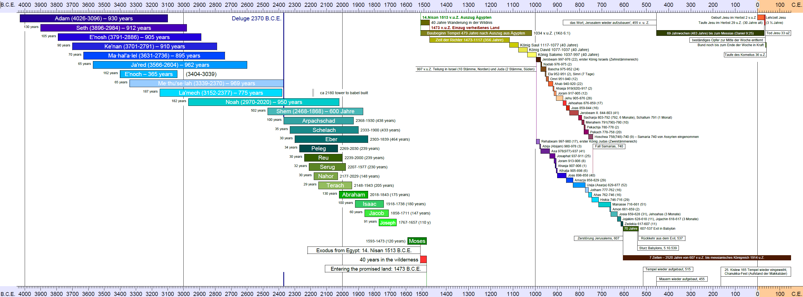
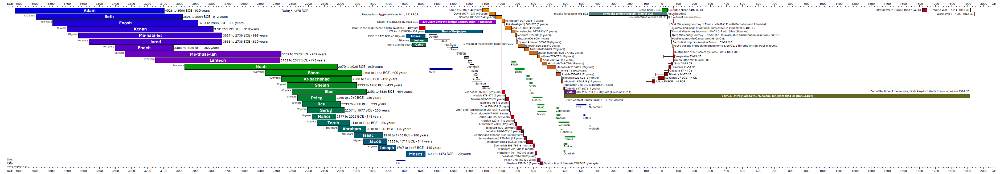

# A Timeline of human history

Expanded timelines on paper have been used to visualize events in the flow of time for a long time. Creating one yourself will immerse you into the details and relations between events even further. A digital project that started in February 2009 and was translated to English in 2023.

By the end of 2023 it was created as a single pdf file with a python program, and translated to a few languages:

## Reactivation 2023

After many years it was finally time to translate the project to English and share with my friends. In the 14 years since beginning this project I learned a lot about programming languages, vector graphics and possible solutions using pandas and matplotlib. In a first stage I translated the old OpenOffice documents to english. Then I collected data into csv files for later automated processing and graph generation. This way the translation to another language is just the change of one import file. So far I translated the first page:

This project started on here on Github on June 10th, 2023. My last day of work.

## Vector Image with .odg in 2015

Using a spreadsheet limits the options in resolution of a digital image or pdf to create. A pixel image does not allow for a good zoom, so I wanted to create a vector image that could be exported as pdf with the ability to zoom into details. On October 12, 2015 I started a LibreOffice 4.4 Drawing ODG with a scale of 1cm for 50 years or 5 years/millimeter, resulting in a document with the dimensions 1250x297 mm. This could be printed on my endless A4 paper roll. [Last export as pdf](https://github.com/kreier/timeline/blob/main/spreadsheet/Zeitleiste_wide_20151213.pdf) on December 13, 2015. 

## Start with a spreadsheet in February 2009

The project to create a paper timeline of human history is done by teenagers around the world. I got an endless paper roll of 10 meters length to start this project, but decided to begin with a digital version. On February 10th, 2009 I created a spreadsheet in OpenOffice 3.0 with 3 tabs for the time 4050-1450 BCE, 1550 BCE - 150 CE and 150-2050 CE. All are designed to fit on a A4 paper, so these 3 pages can be glued together for a single timeline spanning 6000 years.

### 4050 - 1450 BCE

For these 2600 years I chose a resolution of 10 years. The spreadsheet has 260 columns, but for the long periods of this time it is precise enough.

### 1550 BCE - 150 CE

The resolution of only 10 years makes it difficult to visualize shorter time perios like the 2 years that Pekachja ruled Israel from 780-778 BCE or the one year that Ahasja ruled Juda 907-906 BCE. The second tile therefore is divided into columns for 5 years and needs 340 columns for the 1700 years from 1550 BCE to 150 CE.

### 130 BCE - 2050 CE

The third tile went back to 10 years per column and needs 218 columns.

### Scale challenges

To compensate for limited printing area I created a border of 1cm around each page, so the effective width for each tile is 277 millimeter. Given the used time frame this results in different scales years/millimeter for each page. Yet this was one of the fundamental ideas of this project, to represent a larger amount of time with a bigger amount of space or length. Here are the values for comparison:

| page             | begin | end   | timespan | width/mm | years/mm | resolution | columns | created    |
|------------------|-------|-------|----------|----------|----------|------------|---------|------------|
| table 1          | -4050 | -1450 | 2600     | 277      | 9.39     | 10         | 260     | 2009-02-10 |
| table 2          | -1550 | 150   | 1700     | 277      | 6.14     | 5          | 340     | 2009-02-10 |
| table 3          | -130  | 2050  | 2180     | 277      | 7.87     | 10         | 218     | 2009-02-10 |
| drawing odg      | -4000 | 2000  | 6000     | 1250     | 4.8      | ∞          | ∞       | 2015-12-13 |
| reportlab python | -4050 | 2050  | 6100     | 1168     | 5.22     | ∞          | ∞       | 2023-10-17 |

See [scale.csv](https://github.com/kreier/timeline/blob/main/spreadsheet/scale.csv)
