# A Timeline of human history

This project creates a graph of Human history with python and reportlab. Version v3.5 replicates and expands the information of v1.1 from 2009 on one single page. With version 4.2 some images make it into the timeline after 15 years of slow development. See both for comparison below.

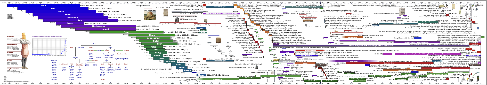

Compare this 4000 year timespan of version 4.2 from 2024:

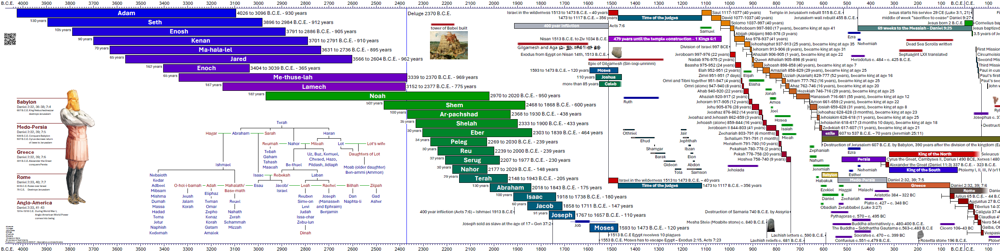

With the same time period in version 1.1 from 2009:

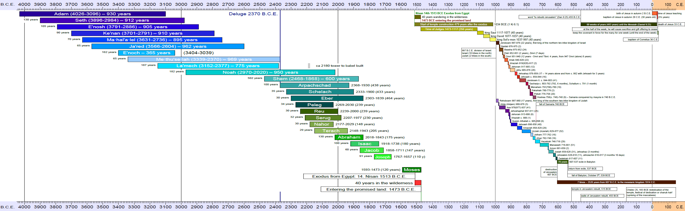

## Create your own pdf file and fix mistakes on the fly

With a Jupyter Notebook you can download all required files and install all software in 2 steps in a virtual machine and then create a fresh pdf in the third step. Edit the downloaded files in your browser and repeat step 3 for an updated version:

- [Jypyter Notebook in Google Colab with reportlab](https://colab.research.google.com/drive/1G0z6jKIs_B_Md_y6Wen108Keo5WazalZ?usp=sharing)
- [Jupyter Notebook in Google Colab with fpdf2](https://colab.research.google.com/drive/1WbLz2Gz775j0bSFPHdQihAkub3wltAof?usp=sharing)

## Reactivation 2023

After 14 years it was finally time to translate the project to English and share with my friends. In the years since 2009 I learned a lot about programming languages, vector graphics and possible solutions using pandas, csv files and reportlab (instead of matplotlib). In a first stage I translated the old OpenOffice documents to English. Then I collected data into csv/tsv files for later automated processing and graph generation. This way the translation to another language is "just" the change of one import file. So far I translated the first page:

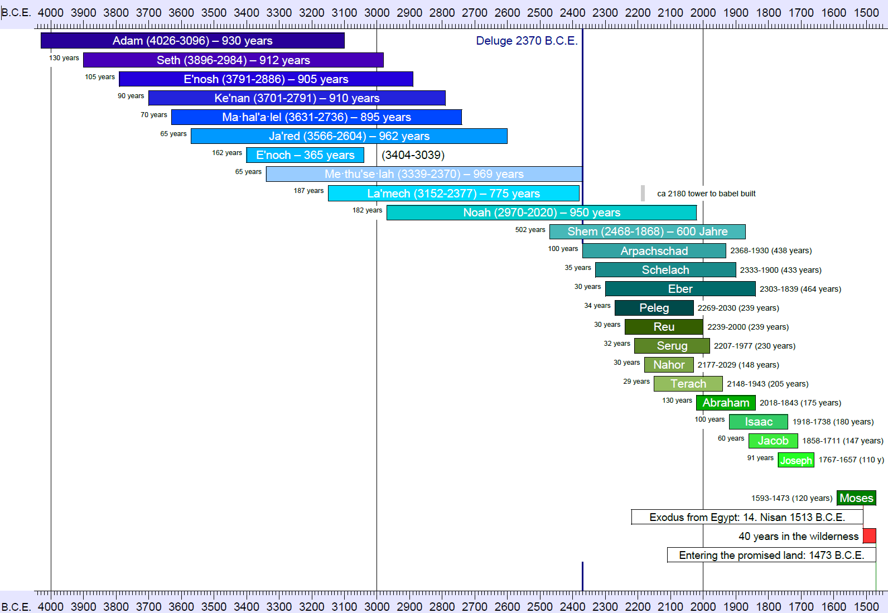

This project started on here on Github on June 10th, 2023. My last day of work.

## Version history

- [v1.0](https://github.com/kreier/timeline/releases/tag/v1.0) 2009/02/10 An [OpenOffice spreadsheet](https://github.com/kreier/timeline/blob/5ffa9bac5cb4ff3c2cdc362b63df161e0d909c9d/spreadsheet/Zeitleiste_3A4_20090210.ods) with 260, 340 and 218 columns to create the overview with a resolution of 5 or 10 years. See the [resulting pdf](https://github.com/kreier/timeline/blob/5ffa9bac5cb4ff3c2cdc362b63df161e0d909c9d/spreadsheet/Zeitleiste_3A4_20090211.pdf). It contains 63 persons, 8 time periods and 20 events.
- [v2.0](https://github.com/kreier/timeline/releases/tag/v2.0) 2015/10/12 A __vector image__ as a LibreOffice odf to cover 6000 years on [one pdf](https://github.com/kreier/timeline/blob/5ffa9bac5cb4ff3c2cdc362b63df161e0d909c9d/spreadsheet/Zeitleiste_wide_20151213.pdf) and no restrictions in the representation of years. It was very cumbersome to edit and by December only the first __24 persons__ were indicated with their lifetime. And 2 time periods and 3 event dates.
- [v1.1](https://github.com/kreier/timeline/releases/tag/v1.1) 2023/06/30 __Translation to English.__ For a broader audience and to get feedback on the planned vector version I translated the original OpenOffice Spreadsheet version to English. By June 30th the exported pdf from LibreOffice was finished with the same __63 persons__, 8 time periods and 20 event dates.
- [v3.0](https://github.com/kreier/timeline/releases/tag/v3.0) 2023/10/22 __Vector document__ generated with [a python program](https://github.com/kreier/timeline/blob/main/python/6000.py) and reportlab. 24 persons, 44 kings and 9 periods.
- [v3.1](https://github.com/kreier/timeline/releases/tag/v3.1) 2023/10/23 __Timebase changed to float__, font size adjusted for nicer overview. Conversion with [a program](https://github.com/kreier/timeline/blob/main/history/convert.py). 68 persons, 11 periods, 6 events.
- [v3.2](https://github.com/kreier/timeline/releases/tag/v3.2) 2023/10/24 Text elements and __colors separated__ from key __events__ and __persons__. 96 persons, 17 periods, 6 events. First printout on A0.
- [v3.3](https://github.com/kreier/timeline/releases/tag/v3.3) 2023/11/04 __First century__ and 6 ancient people. 110 people, 21 periods, 7 events.
- [v3.4](https://github.com/kreier/timeline/releases/tag/v3.4) 2023/11/06 Removal of many hard-coded elements and descriptions from 6000.py to __8 seperate files__. Plus a __colors_normal.csv__ file for the colors and one __dictionary_en.tsv__ for each language with currently 164 entries. First translation to __German__ completed. 
- [v3.5](https://github.com/kreier/timeline/releases/tag/v3.5) 2023/11/22 First translation to __Vietnamese__ completed, minor refinements.
- [v3.6](https://github.com/kreier/timeline/releases/tag/v3.6) 2023/12/28 Adjustments in the location of information to make it easier to compare. Improved Vietnamese translation.
- [v4.0](https://github.com/kreier/timeline/releases/tag/v4.0) 2024/01/30 Languages extended to 10 languages with initial support for CJK (中国人 日本語 한국어) rendering. Translation support started for French, Iloko and Japanese.
- [v4.1](https://github.com/kreier/timeline/releases/tag/v4.1) 2024/02/27 Included Sinhala (සිංහල) and refined __Iloko__ and __Japanese__ (日本語).
- [v4.2](https://github.com/kreier/timeline/releases/tag/v4.2) 2024/03/09 Included the family of Terah and the image from __Daniel 2__ with the world powers from Daniel 7. And 6 small images as illustration.
- [v4.3](https://github.com/kreier/timeline/releases/tag/v4.3) 2024/03/16 Convert dictionary files to __.csv__ format to be easier readable in a [Jupyter Notebook](db/timeline.ipynb). You can create the latest PDF in your language in [Google Colab](https://colab.research.google.com/drive/1G0z6jKIs_B_Md_y6Wen108Keo5WazalZ?usp=sharing) with just a browser.
- [v4.4](https://github.com/kreier/timeline/releases/tag/v4.4) 2024/03/24 Include inventions and insights that enable modern society from the last centuries with pictures. Add some of the __Chinese dynasties__ to the oldest known historic date of 841 BC (Sima Qian) and beyond.
- [v4.5](https://github.com/kreier/timeline/releases/tag/v4.4) 2024/04/13 Include the great tribulation in the time of the end, and a graph of the world population for the last 2000 years. It aligns with advancements in science, culture and society.

### Translations

Since v3.4 the language specific files have been separated from the program code, data information and list of colors. With some good bible translations I get use the reference location of names to get a start of a translation, since the very dates are not changing. This gives a start to translate into another language. With currently 235 text fields I have to rely on Google translate for a first attempt - and then need someone with good language skills in the target language to complete the translation. Our current state:

| language                                                                | version | last updated |
|-------------------------------------------------------------------------|:-------:|:------------:|
| [English](https://timeline24.github.io/timeline_en.pdf)                 |   4.6   |  2024-05-15  |
| [German (Deutsch)](https://timeline24.github.io/timeline_de.pdf)        |   4.6   |  2024-05-15  |
| [Vietnamese (Tiếng Việt)](https://timeline24.github.io/timeline_vi.pdf) |   4.5   |  2024-04-02  |
| [French (Français)](https://timeline24.github.io/timeline_fr.pdf)       |   4.5   |  2024-04-14  |
| [Spanish (Español)](https://timeline24.github.io/timeline_es.pdf)       |   4.5   |  2024-04-23  |
| [Russian (Русский)](https://timeline24.github.io/timeline_ru.pdf)       |   4.5   |  2024-04-15  |
| [Iloko (Ilocano)](https://timeline24.github.io/timeline_ilo.pdf)        |   4.6   |  2024-05-16  |
| [Kankana-ey](https://timeline24.github.io/timeline_kne.pdf)             |   4.6   |  2024-05-16  |
| [Finnish (Suomi)](https://timeline24.github.io/timeline_fi.pdf)         |   4.5   |  2024-04-17  |
| [Tagalog (Filipino)](https://timeline24.github.io/timeline_tl.pdf)      |   4.6   |  2024-05-16  |
| [Norwegian (Norsk)](https://timeline24.github.io/timeline_no.pdf)       |   4.3   |  2024-03-30  |
| [Japanese (日本語)](https://timeline24.github.io/timeline_ja.pdf)        |   4.5   |  2024-04-15  |
| [Korean (한국인)](https://timeline24.github.io/timeline_ko.pdf)          |   4.4   |  2024-03-30  |
| [Sinhala (සිංහල)](https://timeline24.github.io/timeline_si.pdf)         |   4.3   |  2024-03-30   |
| [Chinese Mandarin (Simplified) (中文简体（普通话))](https://timeline24.github.io/timeline_zh.pdf) | 4.4 | 2024-04-04 |
| [Chinese Cantonese (Simplified)  [中文简体（广东话）]](https://timeline24.github.io/timeline_yue.pdf) | 4.4 | 2024-04-04 |
| [Khmer (ខ្មែរ)](https://timeline24.github.io/timeline_km.pdf)             |   4.5   |  2024-04-22  |
| [Arabic (العربية)](https://timeline24.github.io/timeline_ar.pdf)           |   3.6   |              |
| [Igbo (Ásụ̀sụ́ Ìgbò)](https://timeline24.github.io/timeline_ig.pdf)       |   3.6   |              |
| [Thai (ภาษาไทย)](https://timeline24.github.io/timeline_th.pdf)          |   3.6   |              |

Support for languages using the CJK glyphs took some extra work, and I learned a lot about tofu and NO TOfu (noto) and related projects.

### Scale challenges

To compensate for limited printing area I created a border of 1cm around each page. The effective drawing area on A4 landscape in each tile is 277 millimeter. This resulted in _different time scales_ for each page with v1.0, since the covered timespan is not equal for each page. But this was one of the fundamental ideas of this project, to represent a *larger amount of time* with a *bigger amount of space* or length. Here are the values for comparison:

| page             | begin | end   | timespan | width/mm | years/mm | resolution | columns | created    |
|------------------|-------|-------|----------|----------|----------|------------|---------|------------|
| table 1          | -4050 | -1450 | 2600     | 277      | 9.39     | 10         | 260     | 2009-02-10 |
| table 2          | -1550 | 150   | 1700     | 277      | 6.14     | 5          | 340     | 2009-02-10 |
| table 3          | -130  | 2050  | 2180     | 277      | 7.87     | 10         | 218     | 2009-02-10 |
| drawing odg      | -4000 | 2000  | 6000     | 1250     | 4.8      | ∞          | ∞       | 2015-12-13 |
| reportlab python | -4050 | 2050  | 6100     | 1168     | 5.22     | ∞          | ∞       | 2023-10-17 |
| [Adams Chart](https://en.wikipedia.org/wiki/Adams_Synchronological_Chart_or_Map_of_History)     | -4004 | 1900  | 5904     | 6900     | 0.86     | ∞          | ∞       | 1871-01-01 |

See [scale.csv](spreadsheet/scale.csv)

## Inspiration and other solutions

The idea of a [timeline (link to Wikipedia)](https://en.wikipedia.org/wiki/Timeline) is neither unique nor new. One example would be Joseph Priestley's ["A New Chart of History"](https://en.wikipedia.org/wiki/A_New_Chart_of_History) published in 1769 (more than 250 years ago):

Even more similar to my project is [Adams Synchronological Chart or Map of History](https://en.wikipedia.org/wiki/Adams_Synchronological_Chart_or_Map_of_History) from 1871 (more than 150 years ago). In wikimedia is [a scan of 40445x4309 pixel](https://commons.wikimedia.org/wiki/File:Adams_Synchronological_Chart,_1881.jpg) of this masterpiece. And there you would find a link to the 700 Megapixel JPEG 2000 scan file.

In 2008 I got "Knaur's Zeittafel der Weltgeschichte - Den letzten 6000 Jahren auf der Spur" with a total length of 10 meters. I'm far from having all these information included in my edition. Here are links to [two editions](https://www.amazon.de/-/en/Alex-Klubertanz/dp/3828908519/ref=monarch_sidesheet) at [amazon.de](https://www.amazon.de/-/en/dp/3829017057/ref=monarch_sidesheet).

Here is [another example from amazon.de](https://www.amazon.de/Super-Jumbo-History-Timeline-Poster/dp/0721712002/ref=monarch_sidesheet), covering the last 5000 years in 1.2 meter like this project here:

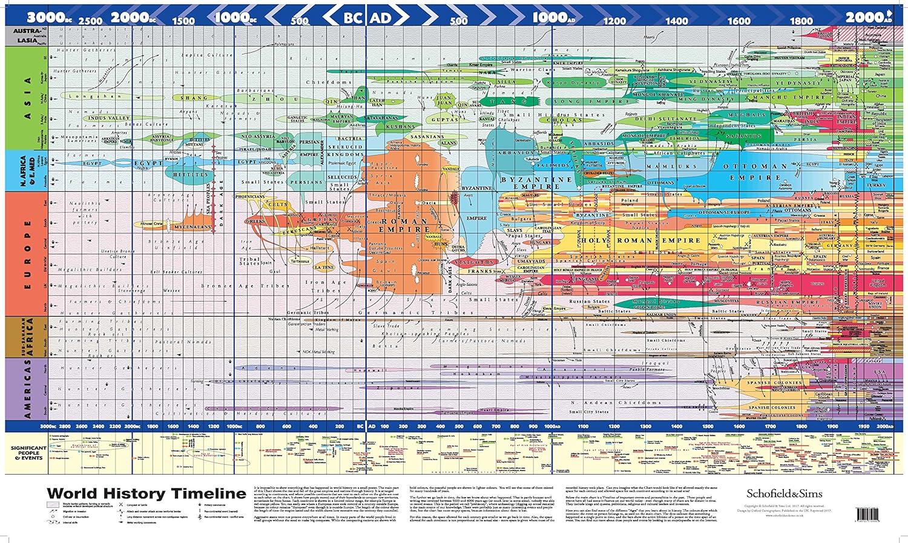 
<!-- 
 

-->

It looks like Knaur's book was inspired by [Adams Synchronological Chart or Map of History](https://www.amazon.com/Adams-Synchronological-Chart-Map-History/dp/0890515131) - it is 23' long (7 meter) and 27" tall (68 cm). Original from 1871.

<!--  -->
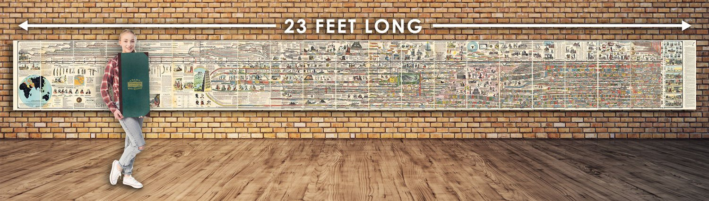

The reformation made [a timeline for the 220 years](https://www.amazon.com/Timeline-of-the-Reformation-Poster/dp/B09DRPQN3V) 1480 - 1700 AD in a similar style.

Another design attempt to pack a lot of information in a written horizontal way into a timeline that progresses from left to right is this [Texan Spiral semicircle project](https://www.amazon.com/Bible-Timeline-History-Chart-Chronological/dp/B0BMWW7WWP):

<!--  -->
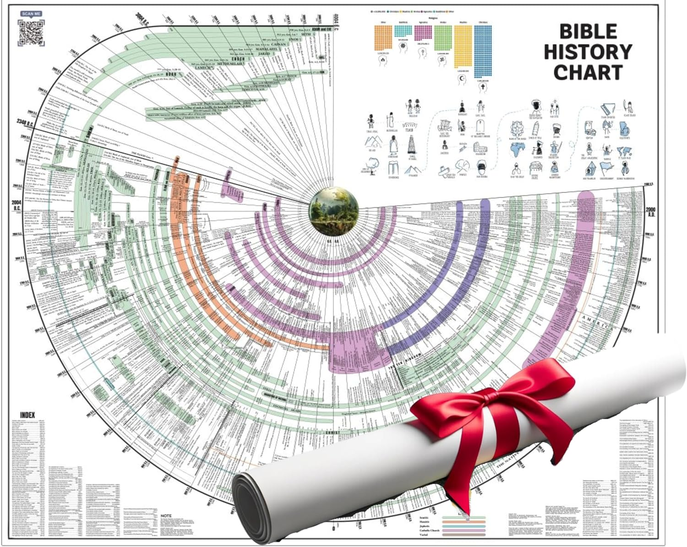

Time of 12 Prophets from 850 BCE to 400 BCE

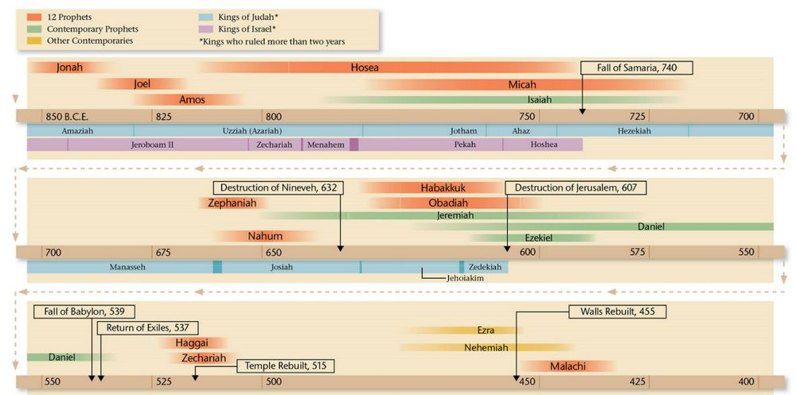

## Vector Image with .odg in 2015

Using a spreadsheet limits the options in resolution of a digital image or pdf to create. A pixel image does not allow for a good zoom, so I wanted to create a vector image that could be exported as pdf with the ability to zoom into details. On October 12, 2015 I started a LibreOffice 4.4 Drawing ODG with a scale of 1cm for 50 years or 5 years/millimeter, resulting in a document with the dimensions 1250x297 mm. This could be printed on my endless A4 paper roll. [Last export as pdf](https://github.com/kreier/timeline/blob/main/spreadsheet/Zeitleiste_wide_20151213.pdf) on December 13, 2015. 

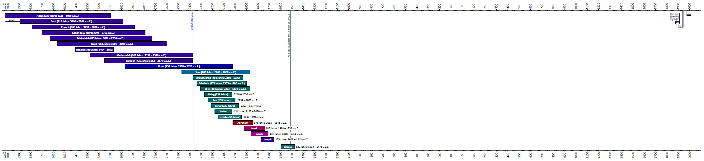

## Start with a spreadsheet in February 2009

The project to create a paper timeline of human history is done by teenagers around the world. I got an endless paper roll of 10 meters length to start this project, but decided to begin with a digital version. On February 10th, 2009 I created a spreadsheet in OpenOffice 3.0 with 3 tabs for the time 4050-1450 BCE, 1550 BCE - 150 CE and 150-2050 CE. All are designed to fit on a A4 paper, so these 3 pages can be glued together for a single timeline spanning 6000 years.

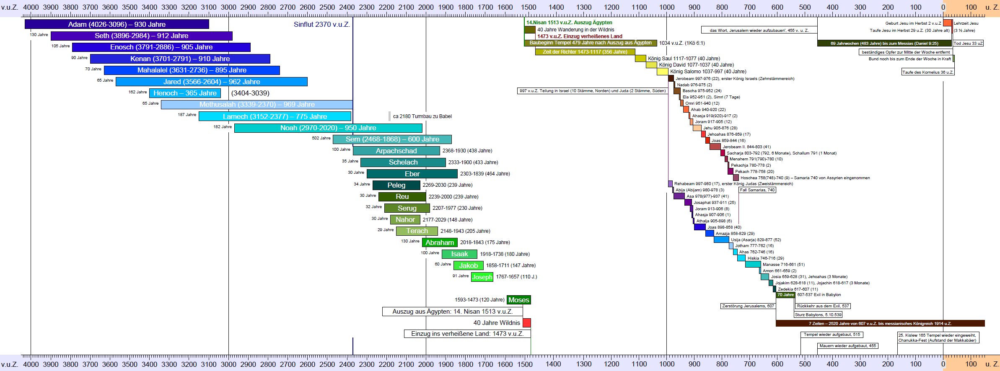

### 4050 - 1450 BCE

For these 2600 years I chose a resolution of 10 years. The spreadsheet has 260 columns, but for the long periods of this time it is precise enough.

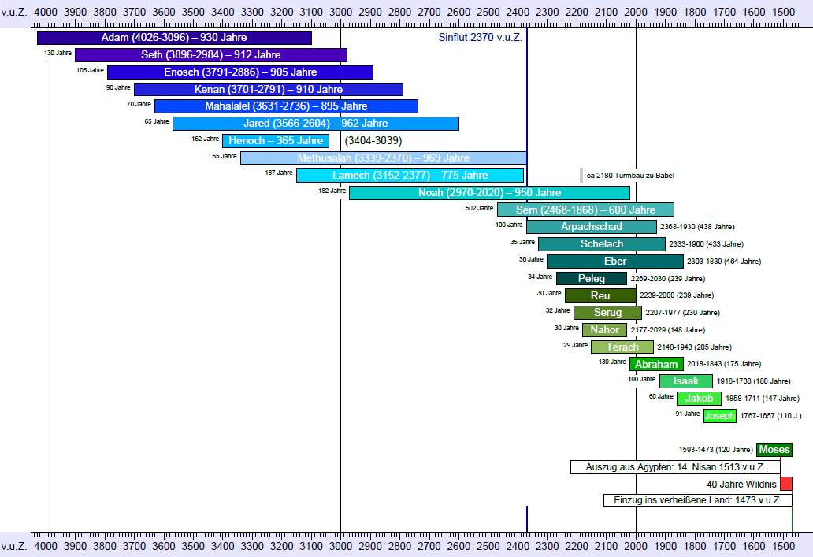

### 1550 BCE - 150 CE

The resolution of only 10 years makes it difficult to visualize shorter time perios like the 2 years that Pekachja ruled Israel from 780-778 BCE or the one year that Ahasja ruled Juda 907-906 BCE. The second tile therefore is divided into columns for 5 years and needs 340 columns for the 1700 years from 1550 BCE to 150 CE.

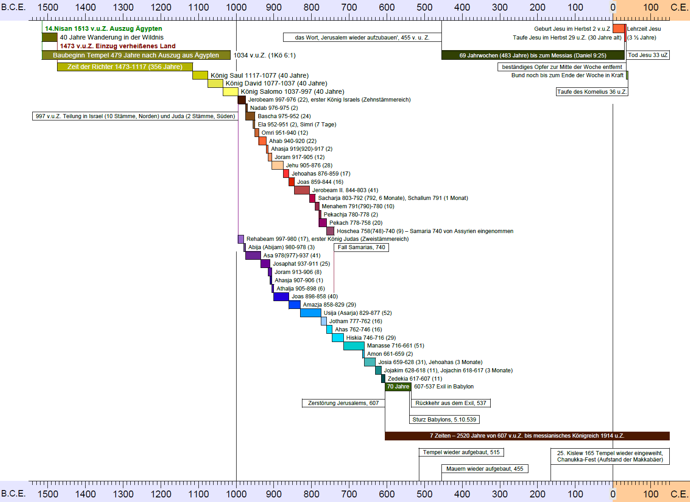

### 130 BCE - 2050 CE

The third tile went back to 10 years per column and needs 218 columns.

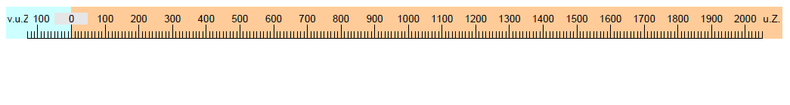

To be continued and get inspired ...

## Short history of this project - with just pictures

#### 2009

#### 2015

#### 2023

#### 2024

