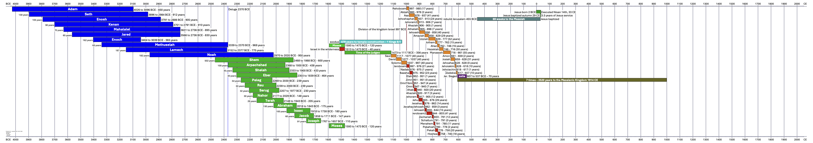
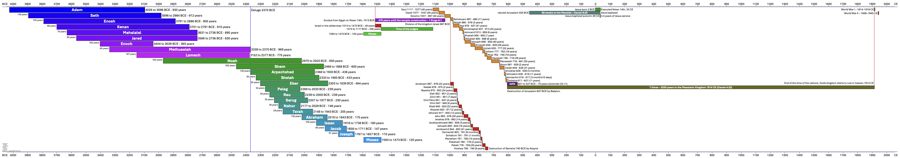
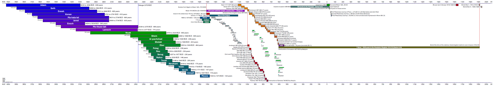
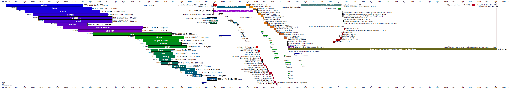
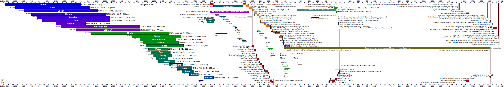

# History of timeline projects

With my retirement starting on June 10th, 2023 I started this repository to create a as graphic document to better align events in the flow of time and visualize connections between people and events. These are:

- Timeline 4026 BCE - 2050 CE to be stretched over four A4 landscape papers
- Timeline 1000 BCE - 607 BCE, the kings in the two-tribe nation of Judah and the 10-tribe nation of Israel

## Inspirations

Some documents gave further insight and inspiration into this project.

- [Strengthen Your Faith in God's Word](https://www.jw.org/en/library/jw-meeting-workbook/january-february-2023-mwb/Life-and-Ministry-Meeting-Schedule-for-January-16-22-2023/Strengthen-Your-Faith-in-Gods-Word/) from mwb23.01 for January 16th, 2023
- [“The Whole House of Ahab Will Perish”—2Ki 9:8](https://www.jw.org/en/library/jw-meeting-workbook/november-december-2022-mwb/Life-and-Ministry-Meeting-Schedule-for-November-28-December-4-2022/The-Whole-House-of-Ahab-Will-Perish-2Ki-98/) from mwb22.11 for November 28th, 2022
- [Chart: Prophets and Kings of Judah and of Israel (Part 1)](https://www.jw.org/en/library/bible/study-bible/appendix-a/kings-of-judah/) from nwtsty in 2013
- [Chart: Prophets and Kings of Judah and of Israel (Part 2)](https://www.jw.org/en/library/bible/study-bible/appendix-a/kings-of-israel/) from nwtsty in 2013

## v3.0 Creation of an vector based version with python and reportlab in October 2023

After starting to write programs in python in 2018 and teaching it from 2022 on this looked like a good project to apply these skills. Reading values from a .csv data file would make the creation process much easier and structured. In early October 2023 I finally got reportlab working with python on both macOS and a WSL installation on Windows 11. The first step was to recreate the two pages from libreoffice with this new method. The targeted size is now 4 pages of A4 in landscape combined. This could be printed with the poster function or given to a professional printer to be released on one A0 paper and creating 4 timelines.

The current edition is v3.5. Early October I wrote "Hopefully by end of October 2023 this is done." That might be true for the initial edition, but the more you work with the document, the more ideas you get. See the growing content from v3.0 in October to v3.5 in November 2023:

Since v3.4 it is also translated to German, with v3.5 a Vietnamese translation was added. And the respective translations have to be extended with each new detail added.

## v1.1 Translation of v1.0 to English in June 2023

The original files from 2009 were created in German. Starting summer 2017 most of my life was going on in English. When sharing this project with friends in early June 2023  I promised to have the translated version ready until the end of month. And the translation was inded completed by June 30th, 2023.

Some black/white copies were print out and shared for feedback. Yet the back of my mind was thinking of an elegant way to make v2.0 come to life.

## v 2.0 Creating a Vector Image with .odg in October 2015

The use of a spreadsheet really limits the possible resolution of the final product, being digital or a printed pdf. Here is a comparison of the resolution of my various approaches:

| page             | begin | end   | timespan | width/mm | years/mm | resolution | columns | created    |
|------------------|-------|-------|----------|----------|----------|------------|---------|------------|
| table 1          | -4050 | -1450 | 2600     | 277      | 9.39     | 10         | 260     | 2009-02-10 |
| table 2          | -1550 | 150   | 1700     | 277      | 6.14     | 5          | 340     | 2009-02-10 |
| table 3          | -130  | 2050  | 2180     | 277      | 7.87     | 10         | 218     | 2009-02-10 |
| drawing odg      | -4000 | 2000  | 6000     | 1250     | 4.8      | ∞          | ∞       | 2015-12-13 |
| reportlab python | -4050 | 2050  | 6100     | 1168     | 5.22     | ∞          | ∞       | 2023-10-17 |

As next step I started to create a vector image that could be exported as pdf with the ability to zoom into details. On October 12, 2015 I started a LibreOffice 4.4 Drawing ODG with a scale of 1cm for 50 years or 5 years/millimeter, resulting in a document with the dimensions 1250x297 mm. This could be printed on my endless A4 paper roll. [Last export as pdf](https://github.com/kreier/timeline/blob/main/spreadsheet/Zeitleiste_wide_20151213.pdf) on December 13, 2015. 

## v1.0 Start with a spreadsheet in February 2009

The project to create a paper timeline of human history is done by teenagers around the world. I got an endless paper roll of 10 meters length to start this project, but decided to begin with a digital version. On February 10th, 2009 I created a spreadsheet in OpenOffice 3.0 with 3 tabs for the time 4050-1450 BCE, 1550 BCE - 150 CE and 150-2050 CE. All are designed to fit on a A4 paper, so these 3 pages can be glued together for a single timeline spanning 6000 years.

### 4050 - 1450 BCE

For these 2600 years I chose a resolution of 10 years. The spreadsheet has 260 columns, but for the long periods of this time it is precise enough.

### 1550 BCE - 150 CE

The resolution of only 10 years makes it difficult to visualize shorter time perios like the 2 years that Pekachja ruled Israel from 780-778 BCE or the one year that Ahasja ruled Juda 907-906 BCE. The second tile therefore is divided into columns for 5 years and needs 340 columns for the 1700 years from 1550 BCE to 150 CE.

### 130 BCE - 2050 CE

The third tile went back to 10 years per column and needs 218 columns.

